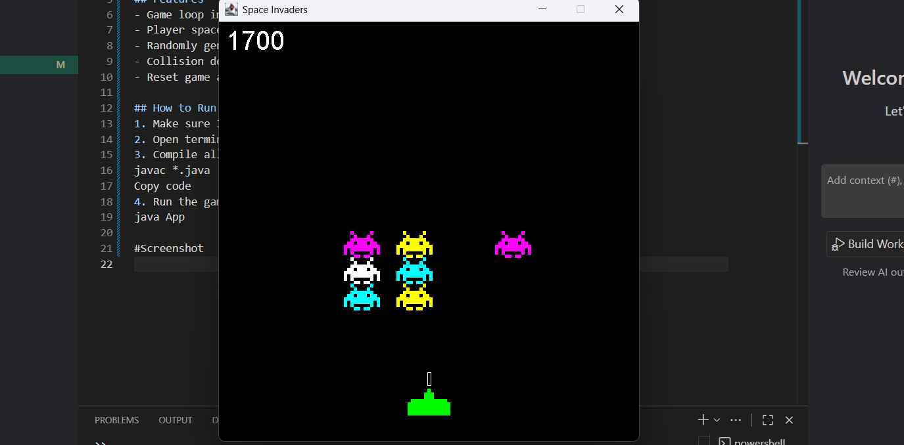

# Space Invaders Java Game

This is a classic Space Invaders game built in Java using OOP concepts and Swing for graphics.

## Features
- Game loop implementation
- Player spaceship movement and bullet firing
- Randomly generated aliens with different colors
- Collision detection and scoring system
- Reset game after clearing aliens

## How to Run
1. Make sure Java JDK is installed.
2. Open terminal/PowerShell in project folder.
3. Compile all Java files:
javac *.java
Copy code
4. Run the game:
java App

#Screenshot
